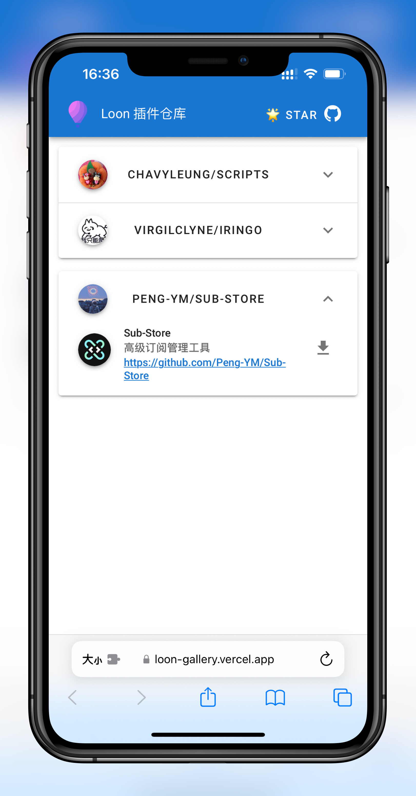

# Loon-Plugin-link
Loon Plugin资源仓库链接


Loon 插件仓库，提供一键式安装 Loon 插件。

<p align="center">

</p>

## 配置
Loon 用户安装仓库[插件](https://raw.githubusercontent.com/jiakun93/Loon-Plugin-link/master/loon-gallery.plugin)，点击访问插件显示网址链接，或访问以下网址即可: https://loon-plugin.vercel.app/， https://whatshub.top/loon

## 如何贡献？
您可以通过以下几个步骤添加一个 GitHub 仓库作为 Loon Gallery 的来源：
1. 首先 Fork 本仓库
2. 修改 [plugin-sources.json](https://github.com/Peng-YM/Loon-Gallery/blob/master/plugin-sources.json) 文件，填写 GitHub 仓库的用户名，仓库名，分支，以及可选的搜索路径（如果未提供该参数，则默认指定根目录）。示例如下：
```json
{
    "user": "Peng-YM",
    "repo": "QuanX",
    "branch": "master",
    "paths": ["/Tools"]
}
```
3. 提交 PR 申请即可。非常感谢您的贡献！
